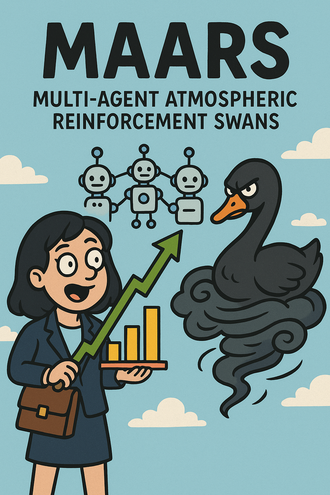

# MAARS

## Multi Agent Atmospheric Reinforcement Swans
(Does that make sense?)

I aim to use Multi Agent Deep Reinforcment Learning and concepts of atmospheric modelling in order to implement portfolio optimization while detecting Black Swan events.

Will be updating my progress here for sanity.