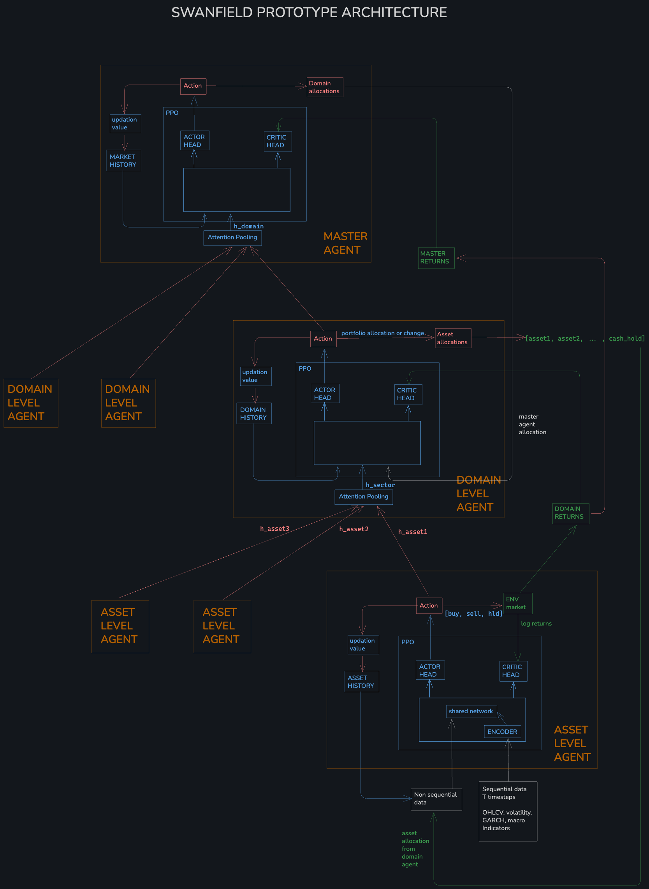

**# SwanField — Hierarchical Multi-Agent Reinforcement Learning for Portfolio Management**

SwanField is a **\*\*hierarchical multi-agent deep reinforcement learning framework for portfolio management\*\***.

The framework consists of three levels of decision-making agents:

1\. **\*\*Asset-level agents\*\*** — specialize in individual assets.

2\. **\*\*Domain-level agents\*\*** — aggregate information across related assets/sectors.

3\. **\*\*Master agent\*\*** — aggregates domain-level information and determines the overall portfolio allocation.

The architecture is inspired by how a hierarchical portfolio-management organization could operate: specialized asset managers communicate with domain/sector managers, who in turn communicate with a master portfolio manager.

The agents use **\*\*Proximal Policy Optimization (PPO)\*\*** with actor-critic architectures and stochastic policies.

\---

**## Architecture**

The information flow is:

\---

**# 1. Asset-Level Agents**

Each asset agent receives:

\- sequential asset data,

\- non-sequential information such as allocation/memory information,

\- and produces four stochastic actions.

The asset policy consists of:

1\. **\*\*BUY / HOLD / SELL\*\***

2\. **\*\*Signal sent to the domain agent\*\***

3\. **\*\*Memory update\*\***

4\. **\*\*Trade fraction\*\***

The implementation uses an LSTM/GRU-based sequence encoder followed by a shared representation and multiple actor heads. The sequence encoder produces the final recurrent hidden representation \`hseq\`.

\---

**## 1.1 Sequential Encoding**

Let the sequential input for an asset be

$$
X_t = \{x_{t-T+1}, \ldots, x_t\}
$$

where \`T\` is the sequence length.

The recurrent encoder produces

$$
h_{\mathrm{seq},t} = \mathrm{RNN}(X_t)
$$

where the RNN can be an LSTM or GRU.

For an LSTM:

$$
(h_t,c_t) = \mathrm{LSTM}(x_t,h_{t-1},c_{t-1})
$$

and the final hidden state is used as the sequence representation:

$$
h_{\mathrm{seq}} = h_T.
$$

In the implementation, the final recurrent hidden state is returned as the asset's sequence encoding.

\---

**## 1.2 Shared Asset Representation**

The sequential representation is concatenated with non-sequential information:

$$
x_t^{\mathrm{asset}} = [h_{\mathrm{seq},t} \Vert x_t^{\mathrm{nonseq}}]
$$

where \`∣∣\` denotes concatenation.

The shared hidden representation is

$$
h_t = \tanh(W_h x_t^{\mathrm{asset}} + b_h).
$$

In the implementation, this shared representation is used by all actor heads and the critic.

\---

**# 2. Asset Policy**

The asset policy is a joint stochastic policy:

$$
\pi_{\theta}(a_t \mid s_t) = \pi_{\theta}^{\mathrm{BHS}} \pi_{\theta}^{\mathrm{signal}} \pi_{\theta}^{\mathrm{memory}} \pi_{\theta}^{\mathrm{fraction}}.
$$

The complete action is

$$
a_t = (a_t^{\mathrm{BHS}}, a_t^{\mathrm{signal}}, a_t^{\mathrm{memory}}, a_t^{\mathrm{fraction}}).
$$

\---

**## 2.1 BUY / HOLD / SELL Head**

The first actor head produces three logits:

$$
z_t = W_{\mathrm{BHS}} h_t + b_{\mathrm{BHS}}
$$

where

$$
z_t \in \mathbb{R}^{3}.
$$

The logits are converted into probabilities using softmax:

$$
\pi_{\theta}^{\mathrm{BHS}}(a \mid s_t) = \frac{e^{z_{t,a}}}{\sum_{j=1}^{3} e^{z_{t,j}}}.
$$

Therefore,

$$
a_t^{\mathrm{BHS}} \sim \mathrm{Categorical}(\pi_{\theta}^{\mathrm{BHS}}).
$$

The three actions are:

$$
\mathcal{A}_{\mathrm{BHS}} = \{\mathrm{BUY},\mathrm{HOLD},\mathrm{SELL}\}.
$$

The implementation constructs this distribution directly from the actor logits.

\---

**## 2.2 Asset → Domain Signal**

The asset agent also generates a continuous signal for the domain agent.

The mean is

$$
\mu_t^{\mathrm{AD}} = W_{\mu}^{\mathrm{AD}} h_t + b_{\mu}^{\mathrm{AD}}
$$

and the raw log-standard-deviation output is

$$
\ell_t^{\mathrm{AD}} = W_{\sigma}^{\mathrm{AD}} h_t + b_{\sigma}^{\mathrm{AD}}.
$$

The implementation clamps this value to maintain a minimum standard deviation:

$$
\tilde{\ell}_t^{\mathrm{AD}} = \max(\ell_t^{\mathrm{AD}}, \log \sigma_{\min}).
$$

The standard deviation is then

$$
\sigma_t^{\mathrm{AD}} = \exp(\tilde{\ell}_t^{\mathrm{AD}}).
$$

Therefore the asset-to-domain signal is sampled from

$$
a_t^{\mathrm{AD}} \sim \mathcal{N}(\mu_t^{\mathrm{AD}},(\sigma_t^{\mathrm{AD}})^2).
$$

For \`d\` signal dimensions, this represents \`d\` independent Gaussian variables.

The implementation uses \`Normal(mean, std)\` for this actor head.

\---

**## 2.3 Memory Update**

The memory head generates a continuous memory update:

$$
\mu_t^{\mathrm{M}} = W_{\mu}^{\mathrm{M}} h_t + b_{\mu}^{\mathrm{M}}
$$

$$
\ell_t^{\mathrm{M}} = W_{\sigma}^{\mathrm{M}} h_t + b_{\sigma}^{\mathrm{M}}
$$

$$
\sigma_t^{\mathrm{M}} = \exp(\max(\ell_t^{\mathrm{M}}, \log \sigma_{\min})).
$$

The memory update is sampled as

$$
a_t^{\mathrm{M}} \sim \mathcal{N}(\mu_t^{\mathrm{M}},(\sigma_t^{\mathrm{M}})^2).
$$

Thus, the agent can maintain a learned continuous internal state across timesteps.

The implementation contains separate mean and standard-deviation heads for this distribution.

\---

**## 2.4 Trade Fraction**

The trade-fraction head determines what fraction of the available position/capital should be involved in the trade.

The mean is constrained to \`[0,1]\`:

$$
\mu_t^{\mathrm{F}} = \sigma(W_{\mu}^{\mathrm{F}} h_t + b_{\mu}^{\mathrm{F}})
$$

where

$$
\sigma(x) = \frac{1}{1+e^{-x}}.
$$

The standard deviation is

$$
\sigma_t^{\mathrm{F}} = \exp(\max(\ell_t^{\mathrm{F}}, \log \sigma_{\min})).
$$

The trade fraction is sampled from

$$
a_t^{\mathrm{F}} \sim \mathcal{N}(\mu_t^{\mathrm{F}},(\sigma_t^{\mathrm{F}})^2).
$$

The sampled value is finally clipped to the valid interval:

$$
a_t^{\mathrm{F}} = \operatorname{clip}(a_t^{\mathrm{F}},0,1).
$$

This corresponds to the implementation's sigmoid mean followed by sampling and clipping.

\---

**# 3. Joint Asset Log-Probability**

Because the asset action consists of multiple stochastic components, the total log-probability is the sum of the component log-probabilities:

$$
\log \pi_{\theta}(a_t \mid s_t) = \log \pi_{\mathrm{BHS}} + \log \pi_{\mathrm{AD}} + \log \pi_{\mathrm{M}} + \log \pi_{\mathrm{F}}.
$$

For the Gaussian components,

$$
\log \pi_{\mathrm{AD}} = \sum_i \log \mathcal{N}(a_{t,i}^{\mathrm{AD}};\mu_{t,i}^{\mathrm{AD}},(\sigma_{t,i}^{\mathrm{AD}})^2)
$$

and similarly for memory and trade fraction.

Therefore:

$$
\log \pi_{\theta}(a_t \mid s_t) = \log \pi_{\mathrm{BHS}} + \sum_i \log \pi_{\mathrm{AD},i} + \sum_i \log \pi_{\mathrm{M},i} + \sum_i \log \pi_{\mathrm{F},i}
$$

The implementation explicitly constructs this sum before storing the PPO log-probability.

\---

**# 4. Asset Critic**

The critic shares the common hidden representation \`ht\` with the actor heads.

It estimates the state value:

$$
V_{\phi}(s_t) = W_V h_t + b_V.
$$

Thus,

$$
V_{\phi}(s_t) \approx \mathbb{E}\left[\sum_{k=0}^{\infty}\gamma^k r_{t+k}\mid s_t\right].
$$

The implementation produces this scalar through a linear critic head.

\---

**# 5. Domain-Level Agents**

A domain agent aggregates information from multiple asset agents.

For example:

\`\`\`text

AAPL ─┐

MSFT ─┤

NVDA ─┤

GOOG ─┼──> Tech Domain Agent

TSLA ─┤

...  ─┘

\`\`\`

Each asset produces an embedding

$$
h_i^{\mathrm{asset}}
$$

which is provided to the domain agent.

The domain agent uses an **\*\*attention pooling mechanism\*\*** to aggregate these asset representations:

$$
H_{\mathrm{assets}} = \{h_1,\ldots,h_N\}.
$$

The attention mechanism produces:

$$
h_{\mathrm{domain}} = \operatorname{AttentionPool}(H_{\mathrm{assets}}).
$$

This creates a fixed-size domain representation regardless of the number/order of individual asset representations.

\---

**## 5.1 Domain Input**

The domain agent receives three sources of information:

$$
x_t^{\mathrm{D}} = [h_{\mathrm{domain}} \Vert m_t^{\mathrm{D}} \Vert s_t^{\mathrm{M}\to\mathrm{D}}].
$$

where:

\- \`hdomain\` = pooled asset representation,

\- \`mtD\` = domain memory,

\- \`stM→D\` = signal from the master agent.

The shared domain representation is then

$$
h_t^{\mathrm{D}} = \operatorname{ReLU}(W_{\mathrm{D}}x_t^{\mathrm{D}}+b_{\mathrm{D}}).
$$

This corresponds to concatenating the attention-pooled asset representation, master signal, and memory before the shared network.

\---

**# 6. Domain-Level Actions**

The domain agent produces three outputs:

1\. **\*\*Asset allocation\*\***

2\. **\*\*Domain → Master signal\*\***

3\. **\*\*Memory update\*\***

\---

**## 6.1 Asset Allocation with a Dirichlet Policy**

Instead of independently predicting each asset's allocation, the domain agent produces the concentration parameters of a **\*\*Dirichlet distribution\*\***.

The network first produces raw outputs:

$$
z_t^{\mathrm{D}} = W_{\mathrm{alloc}}h_t^{\mathrm{D}}+b_{\mathrm{alloc}}.
$$

These are converted into positive concentration parameters:

$$
\alpha_t = \operatorname{softplus}(z_t^{\mathrm{D}})+\epsilon.
$$

where

$$
\alpha_{t,i}>0.
$$

The allocation vector is then sampled as

$$
a_t^{\mathrm{D}}\sim\operatorname{Dirichlet}(\alpha_t).
$$

Therefore,

$$
a_t^{\mathrm{D}}=[a_{t,1},a_{t,2},\ldots,a_{t,N},a_{t,\mathrm{cash}}]
$$

with

$$
a_{t,i}\ge 0
$$

and

$$
\sum_i a_{t,i}=1
$$

This naturally represents portfolio allocation because the outputs form a probability-simplex vector.

The implementation uses \`softplus(raw_alpha) + 1e-3\` to ensure positive Dirichlet concentration parameters.

\---

**## 6.2 Domain → Master Signal**

The domain agent produces a continuous signal to the master agent:

$$
\mu_t^{\mathrm{DM}}=W_{\mu}^{\mathrm{DM}}h_t^{\mathrm{D}}+b_{\mu}^{\mathrm{DM}}
$$

$$
\sigma_t^{\mathrm{DM}}=\exp(\max(W_{\sigma}^{\mathrm{DM}}h_t^{\mathrm{D}}+b_{\sigma}^{\mathrm{DM}},\log\sigma_{\min})).
$$

The signal is sampled as

$$
a_t^{\mathrm{DM}}\sim\mathcal{N}(\mu_t^{\mathrm{DM}},(\sigma_t^{\mathrm{DM}})^2).
$$

Thus the master agent receives learned stochastic signals from each domain agent.

\---

**## 6.3 Domain Memory Update**

Similarly,

$$
\mu_t^{\mathrm{M,D}}=W_{\mu}^{\mathrm{M,D}}h_t^{\mathrm{D}}+b_{\mu}^{\mathrm{M,D}}
$$

and

$$
\sigma_t^{\mathrm{M,D}}=\exp(\max(W_{\sigma}^{\mathrm{M,D}}h_t^{\mathrm{D}}+b_{\sigma}^{\mathrm{M,D}},\log\sigma_{\min})).
$$

Then

$$
m_{t+1}^{\mathrm{D}}\sim\mathcal{N}(\mu_t^{\mathrm{M,D}},(\sigma_t^{\mathrm{M,D}})^2).
$$

\---

**# 7. Domain Critic**

The domain critic estimates:

$$
V_{\phi}^{\mathrm{D}}(s_t^{\mathrm{D}})=W_V^{\mathrm{D}}h_t^{\mathrm{D}}+b_V^{\mathrm{D}}.
$$

Therefore the domain agent has its own value function describing the expected future return from the domain's current state.

\---

**# 8. Domain Joint Policy**

The domain action consists of:

$$
a_t^{\mathrm{D}}=(a_t^{\mathrm{alloc}},a_t^{\mathrm{DM}},a_t^{\mathrm{M,D}}).
$$

Its joint policy is therefore:

$$
\pi_{\theta}^{\mathrm{D}}=\pi_{\theta}^{\mathrm{alloc}}\pi_{\theta}^{\mathrm{DM}}\pi_{\theta}^{\mathrm{M,D}}.
$$

The joint log-probability is

$$
\log\pi_{\theta}^{\mathrm{D}}(a_t\mid s_t)=\log\pi_{\theta}^{\mathrm{alloc}}+\log\pi_{\theta}^{\mathrm{DM}}+\log\pi_{\theta}^{\mathrm{M,D}}
$$

which is exactly the quantity used to construct the PPO probability ratio.

\---

**# 9. Master Agent**

The master agent sits at the highest level of the hierarchy.

It receives the representations generated by the domain agents:

$$
H_{\mathrm{D}}=\{h_1^{\mathrm{D}},h_2^{\mathrm{D}},\ldots,h_K^{\mathrm{D}}\}.
$$

These are aggregated using attention pooling:

$$
h_t^{\mathrm{M}}=\operatorname{AttentionPool}(H_{\mathrm{D}}).
$$

The master representation is then combined with master memory:

$$
x_t^{\mathrm{M}}=[h_t^{\mathrm{M}}\Vert m_t^{\mathrm{M}}].
$$

The shared master representation is

$$
h_t=\operatorname{ReLU}(W_{\mathrm{M}}x_t^{\mathrm{M}}+b_{\mathrm{M}}).
$$

\---

**# 10. Master Portfolio Allocation**

The master agent produces allocations across domains plus a cash allocation.

Raw allocation outputs are:

$$
z_t^{\mathrm{M}}=W_{\mathrm{alloc}}^{\mathrm{M}}h_t^{\mathrm{M}}+b_{\mathrm{alloc}}^{\mathrm{M}}.
$$

These are transformed into Dirichlet concentration parameters:

$$
\alpha_t^{\mathrm{M}}=\operatorname{softplus}(z_t^{\mathrm{M}})+\epsilon.
$$

The master allocation is sampled from:

$$
a_t^{\mathrm{M}}\sim\operatorname{Dirichlet}(\alpha_t^{\mathrm{M}})
$$

where

$$
a_t^{\mathrm{M}}=[a_{t,1}^{\mathrm{domain}},\ldots,a_{t,K}^{\mathrm{domain}},a_{t,\mathrm{cash}}]
$$

and

$$
\sum_i a_{t,i}^{\mathrm{M}}=1.
$$

Thus, the master agent determines the high-level allocation across domains while the domain agents determine allocations within those domains.

\---

**# 11. Master Memory**

The master memory update is represented by a Gaussian policy:

$$
\mu_t^{\mathrm{M}}=W_{\mu}^{\mathrm{M}}h_t+b_{\mu}^{\mathrm{M}}
$$

$$
\sigma_t^{\mathrm{M}}=\exp(\max(W_{\sigma}^{\mathrm{M}}h_t+b_{\sigma}^{\mathrm{M}},\log\sigma_{\min})).
$$

The new memory is sampled as

$$
m_{t+1}^{\mathrm{M}}\sim\mathcal{N}(\mu_t^{\mathrm{M}},(\sigma_t^{\mathrm{M}})^2).
$$

\---

**# 12. Master Critic**

The master critic estimates the value of the global portfolio state:

$$
V_{\phi}^{\mathrm{M}}(s_t)=W_V^{\mathrm{M}}h_t+b_V^{\mathrm{M}}.
$$

This provides the value estimate used to calculate the PPO advantage and critic loss.

\---

**# 13. PPO Training**

All three levels use **\*\*Proximal Policy Optimization (PPO)\*\***.

For a transition \`t\`, let:

$$
r_t(\theta)=\frac{\pi_{\theta}(a_t\mid s_t)}{\pi_{\theta_{\mathrm{old}}}(a_t\mid s_t)}.
$$

Using log-probabilities:

$$
r_t(\theta)=\exp\left(\log\pi_{\theta}(a_t\mid s_t)-\log\pi_{\theta_{\mathrm{old}}}(a_t\mid s_t)\right)
$$

This is the exact probability ratio used by the implementation.

\---

**## 13.1 Advantage**

The PPO actor uses an estimated advantage:

$$
A_t=R^t-V_{\phi}(s_t)
$$

where \`R^t\` is the estimated return.

The advantage measures whether the selected action performed better or worse than expected under the critic's estimate.

\---

**# 14. PPO Clipped Objective**

The two surrogate objectives are:

$$
L_t^{\mathrm{CLIP}}=r_t(\theta)A_t
$$

and

$$
\tilde{L}_t^{\mathrm{CLIP}}=\operatorname{clip}(r_t(\theta),1-\epsilon,1+\epsilon)A_t.
$$

The PPO objective is:

$$
L^{\mathrm{CLIP}}=\mathbb{E}_t[\min(r_tA_t,\operatorname{clip}(r_t,1-\epsilon,1+\epsilon)A_t)]
$$

where the implementation uses

$$
\epsilon=0.2.
$$

The actor loss is the negative of this objective:

$$
L_{\mathrm{actor}}=-\mathbb{E}_t[\min(r_tA_t,\operatorname{clip}(r_t,1-\epsilon,1+\epsilon)A_t)].
$$

This clipping prevents the updated policy from moving excessively far from the old policy.

\---

**# 15. Critic Loss**

The critic is trained using mean squared error between the estimated return and value prediction:

$$
L_{\mathrm{value}}=\mathbb{E}_t[(R^t-V_{\phi}(s_t))^2]
$$

The implementation uses this directly as:

$$
(return-value)^2.
$$

\---

**# 16. Entropy Regularization**

Entropy encourages the policy to retain exploration.

For a policy \`π\`:

$$
H(\pi)=-\mathbb{E}_{a\sim\pi}[\log\pi(a\mid s)].
$$

For the multi-head asset policy:

$$
H_{\mathrm{asset}}=H_{\mathrm{BHS}}+H_{\mathrm{AD}}+H_{\mathrm{memory}}+H_{\mathrm{fraction}}.
$$

Similarly, the domain policy entropy is:

$$
H_{\mathrm{domain}}=H_{\mathrm{allocation}}+H_{\mathrm{DM}}+H_{\mathrm{memory}}.
$$

The master policy entropy is:

$$
H_{\mathrm{master}}=H_{\mathrm{allocation}}+H_{\mathrm{memory}}.
$$

\---

**# 17. Total PPO Loss**

The total optimization objective combines the actor, critic, and entropy terms:

$$
L=L_{\mathrm{actor}}+c_1L_{\mathrm{value}}-c_2H
$$

where:

$$
c_1=0.5
$$

is the value-loss coefficient and

$$
c_2=0.01
$$

is the entropy coefficient.

The negative entropy term means that increasing entropy decreases the optimization loss, encouraging exploration.

The implementation uses these same coefficients for the asset, domain, and master agents.

\---

**# 18. Gradient Stabilization**

After computing the total loss, gradients are backpropagated through the shared actor-critic architecture.

Gradient clipping is applied:

$$
\|\nabla_{\theta}L\|_2\le 0.5
$$

by clipping the gradient norm to a maximum of \`0.5\`.

The optimizer is Adam with a default learning rate of:

$$
\alpha=3\times10^{-4}.
$$

\---

**# 19. Hierarchical Portfolio Decision**

The overall decision process can be summarized mathematically as:

**### Asset level**

$$
X_i\to h_i^{\mathrm{asset}}\to\{\mathrm{BUY/HOLD/SELL,\ Trade\ fraction,\ Memory\ update,\ Asset\to Domain\ signal}\}
$$

**### Domain level**

$$
\{h_i^{\mathrm{asset}}\}\to\operatorname{AttentionPool}\to h^{\mathrm{domain}}\to\{\mathrm{Asset\ allocations,\ Domain\to Master\ signal,\ Memory\ update}\}
$$

**### Master level**

$$
\{h_j^{\mathrm{domain}}\}\to\operatorname{AttentionPool}\to h^{\mathrm{master}}\to\{\mathrm{Domain\ allocations,\ Memory\ update}\}
$$

Therefore:

$$
\mathrm{Assets}\to\mathrm{Domains}\to\mathrm{Master}
$$

for information aggregation, while:

$$
\mathrm{Master}\to\mathrm{Domains}\to\mathrm{Assets}
$$

provides hierarchical allocation/control signals.

\---

**# 20. Anti-Fragility Objective**

The asset-level reward is designed to emphasize profitability during periods of high volatility.

The current conceptual objective is to reward returns generated under volatile market conditions rather than simply maximizing raw returns.

For a portfolio return \`Rt\`, the framework can be expressed conceptually as:

$$
r_t^{\mathrm{portfolio}}=\log\left(\frac{P_t}{P_{t-1}}\right)
$$

with the reward incorporating a volatility-dependent component:

$$
r_t=f(r_t^{\mathrm{portfolio}},\sigma_t^{\mathrm{market}}).
$$

The intention is to encourage policies that can exploit or remain resilient during high-volatility regimes, forming the basis of the project's **\*\*anti-fragility\*\*** objective.

\---

**# 21. Parameter Sharing**

Asset agents use parameter sharing.

Instead of learning independent networks:

$$
\theta_1,\theta_2,\ldots,\theta_N
$$

for \`N\` assets, the agents share a common parameter set:

$$
\theta_{\mathrm{asset},1}=\theta_{\mathrm{asset},2}=\cdots=\theta_{\mathrm{asset},N}=\theta_{\mathrm{shared}}
$$

while receiving different asset-specific observations.

This allows the same policy to learn generalizable patterns across different assets.

The same principle is used for domain-level agents.

\---

**# 22. Complete Hierarchical Objective**

Conceptually, SwanField therefore optimizes a hierarchy of stochastic policies:

$$
\pi=\{\pi_{\mathrm{asset}},\pi_{\mathrm{domain}},\pi_{\mathrm{master}}\}.
$$

The complete system can be viewed as:

$$
\mathrm{Market\ Data}\to\mathrm{Asset\ Policies}\to\mathrm{Domain\ Policies}\to\mathrm{Master\ Policy}\to\mathrm{Portfolio\ Allocation}
$$

while feedback flows in the opposite direction:

$$
\mathrm{Master\ Signal}\to\mathrm{Domain\ Policies}\to\mathrm{Asset\ Policies}
$$

The resulting architecture combines:

\- hierarchical multi-agent reinforcement learning,

\- PPO actor-critic optimization,

\- recurrent sequence modelling,

\- attention-based hierarchical aggregation,

\- stochastic continuous policies,

\- Dirichlet portfolio allocation,

\- learned memory,

\- parameter sharing,

\- and volatility-aware reward design.